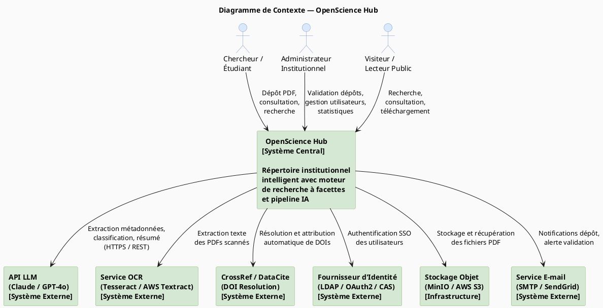
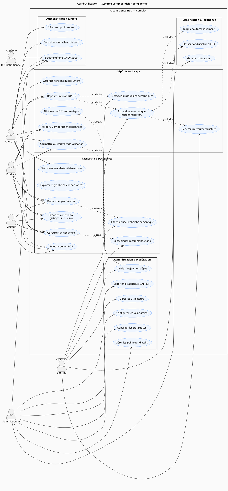

# 🏛️ OpenScience Hub — Répertoire Institutionnel Intelligent
### Document d'Architecture & Stratégie Hackathon
> **Rôle :** Architecte Logiciel Senior · Product Manager · Expert en Ingénierie Académique

---

## Table des Matières

1. [Analyse Stratégique et Innovation](#1-analyse-stratégique-et-innovation)
2. [État de l'Art et Propositions Game-Changer](#2-état-de-lart-et-propositions-game-changer)
3. [Architecture et Logique Métier](#3-architecture-et-logique-métier)
4. [Modélisation UML (PlantUML)](#4-modélisation-uml-plantuml)
5. [⚠️ Analyse Critique — Angles Morts et Risques](#5-️-analyse-critique--angles-morts-et-risques)

---

## 1. Analyse Stratégique et Innovation

### 1.1 Pain Points Majeurs des Répertoires Institutionnels Actuels

| # | Pain Point | Impact Utilisateur | Fréquence |
|---|-----------|-------------------|-----------|
| 1 | **Formulaire de dépôt fastidieux** : saisie manuelle de 15+ champs de métadonnées (titre, auteur, mots-clés, résumé, discipline…) | Abandon du dépôt, données incomplètes ou erronées | 🔴 Très élevée |
| 2 | **Moteur de recherche rudimentaire** : recherche plein texte non sémantique, résultats non pertinents, zéro personnalisation | Introuvabilité des travaux → travaux existants ignorés | 🔴 Très élevée |
| 3 | **Absence de déduplication** : doublons massifs entre promotions, versions multiples non gérées | Données corrompues, confusion sur la version canonique | 🟠 Élevée |
| 4 | **Silotage institutionnel** : chaque université a son propre silo, pas d'interopérabilité | Travaux nationaux/régionaux invisibles à l'échelle globale | 🟠 Élevée |
| 5 | **UX archaïque** : interfaces vieillissantes (DSpace, EPrints), non-responsive, aucune expérience mobile | Abandon massif par les étudiants et jeunes chercheurs | 🟡 Moyenne–Haute |
| 6 | **Absence de recommandations** : aucune suggestion de travaux connexes, pas de graphe de citations | Aucune découverte passive de la connaissance | 🟡 Moyenne |
| 7 | **Workflow de validation opaque** : les auteurs ne savent pas où en est leur soumission | Frustration, relances manuelles par e-mail | 🟡 Moyenne |

### 1.2 La Réelle Valeur Ajoutée de l'IA (au-delà du gadget)

L'IA dans ce contexte n'est pas un ornement : elle résout des **goulots d'étranglement structurels** du workflow académique.

```
Avant (sans IA)                          Après (avec IA)
─────────────────────────────────────    ────────────────────────────────────────
Dépôt d'un mémoire : ~20 minutes        Dépôt d'un mémoire : ~2 minutes
Saisie manuelle de 15 champs            Pré-remplissage automatique à 90%+
Mots-clés oubliés ou génériques         Mots-clés extraits du corpus textuel
Résumé copié-collé par l'auteur         Résumé standardisé + abstract EN généré
Classification manuelle par domaine     Tag de discipline automatique (DDC/JEL)
Doublons détectés... jamais             Alerte de similarité avant soumission
```

**Valeurs ajoutées IA concrètes :**
- **Extraction de métadonnées** : LLM parse le PDF et remonte titre, auteur(s), institution, directeur de thèse, date, résumé, mots-clés, discipline, références bibliographiques.
- **Classification automatique** : assignation dans la taxonomie institutionnelle (ex. Dewey, ACM CCS) via zero-shot classification.
- **Détection de doublons sémantiques** : embeddings vectoriels pour détecter des travaux similaires (pas uniquement titre exact).
- **Amélioration de la découvrabilité** : génération de titres alternatifs, traduction automatique de résumés (FR↔EN), enrichissement des tags.
- **Résumé augmenté** : generation d'un résumé structuré (problématique, méthode, résultats, conclusion) standardisé.

### 1.3 Trois Axes d'Innovation Concrets et Réalisables en Hackathon

#### Axe 1 — 🚀 "Zero-Form Deposit" (Dépôt sans friction)
**Concept :** L'utilisateur glisse-dépose son PDF. L'IA pré-remplit 100% du formulaire en 3–5 secondes. L'utilisateur ne fait que *valider et corriger*.

**Stack technique hackathon :**
- Backend Python (FastAPI) + `PyMuPDF` pour l'extraction texte
- Appel LLM (Claude Sonnet / GPT-4o-mini) avec un prompt structuré → retour JSON
- Frontend React avec formulaire pré-rempli éditable

**Faisabilité en 24–48h :** ✅ Oui (pipeline en ~6h de dev)

---

#### Axe 2 — 🔍 "Faceted Semantic Search" (Recherche à facettes sémantique)
**Concept :** Moteur de recherche combinant filtres structurels (année, type, discipline, auteur, institution) ET compréhension sémantique de la requête. `"mémoire sur la corruption au Cameroun"` retrouve des travaux intitulés *"Analyse de la gouvernance publique au Cameroun"*.

**Stack technique hackathon :**
- **Meilisearch** (Docker, en 5 minutes) pour la recherche à facettes classique
- Optionnel : pgvector (PostgreSQL) pour la recherche vectorielle
- Hybrid search : BM25 + cosine similarity des embeddings

**Faisabilité en 24–48h :** ✅ Oui avec Meilisearch pur (la couche vectorielle est un bonus)

---

#### Axe 3 — 📊 "Research Graph" (Graphe de connaissances académique)
**Concept :** Visualisation interactive des liens entre travaux (citations, co-auteurs, thèmes communs). Permet de naviguer dans le corpus de façon exploratoire.

**Stack technique hackathon :**
- Extraction des références bibliographiques via regex / LLM
- Stockage des relations dans PostgreSQL (table `references`)
- Visualisation avec **D3.js** ou **Cytoscape.js**

**Faisabilité en 24–48h :** ⚠️ Ambitieux — à réserver comme bonus si le temps le permet

---

## 2. État de l'Art et Propositions Game-Changer

### 2.1 Tableau Comparatif des Solutions Existantes

| Plateforme | Modèle | Points Forts | Points Faibles | IA native ? |
|-----------|--------|-------------|----------------|------------|
| **HAL** (CCSD) | Libre, France | Référence nationale FR, DOI, OAI-PMH, coverage élevée | UX datée (2000s), dépôt complexe, recherche basique, lenteur de modération | ❌ |
| **DSpace** | Open Source (MIT) | Très déployé, flexible, communauté large, OAI-PMH | Installation lourde (Java), UX austère, personnalisation complexe, pas de facettes avancées | ❌ |
| **EPrints** | Open Source (Southampton) | Mature, configurable, export BibTeX | Interface vieillissante, stack Perl, faible scalabilité, zero recommandation | ❌ |
| **Zenodo** (CERN) | Libre | Dépôt ultra-simple, DOI automatique, versioning, 50 Go gratuits | Pas conçu pour la recherche institutionnelle, pas de workflow de validation, recherche basique | ❌ |
| **CORE** | Agrégateur | 250M+ documents, API ouverte, bonne recherche | Pas une solution de dépôt, ne gère pas le workflow interne | Partiel (NLP basique) |
| **Isidore** | Agrégateur SHS | Agrégation SHS francophone, facettes thématiques | Limité aux SHS, pas de dépôt direct, indexation externe | Partiel |
| **OpenAlex** | Graph API | Graphe de citations mondial, API gratuite, entités liées | Lecture seule, pas de dépôt, couverture partielle du Global South | ❌ |

### 2.2 Deux Fonctionnalités "Game Changer" Manquantes

#### 🏆 Game Changer #1 — "Instant AI Onboarding" (Ingestion sans friction)

**Ce qui manque partout :** Aucune des plateformes existantes ne propose une ingestion automatique du PDF → métadonnées complètes sans saisie manuelle. Toutes exigent encore de remplir des formulaires fastidieux.

**Ce que vous apportez :**
```
[PDF uploadé] ─→ [LLM Pipeline] ─→ [JSON structuré]
                                        ├─ title: "..."
                                        ├─ authors: ["...", "..."]
                                        ├─ abstract: "..."
                                        ├─ keywords: ["...", "..."]
                                        ├─ discipline: "Informatique"
                                        ├─ type: "Mémoire Master 2"
                                        └─ references: [...]
                                   ─→ [Formulaire pré-rempli pour validation]
```

**Impact réel :** Réduit le temps de dépôt de 20 min → 2 min. Augmente la qualité des métadonnées de 60–70%.

---

#### 🏆 Game Changer #2 — "Semantic Discovery Engine" (Découverte active)

**Ce qui manque partout :** La recherche reste keyword-based. Aucune plateforme institutionnelle francophone ne propose une recherche sémantique + recommandation contextuelle + exploration par similarité.

**Ce que vous apportez :**
- Requête en langue naturelle complète : *"je cherche des études sur l'impact des microplastiques sur la faune aquatique au Cameroun"*
- Résultats classés par pertinence sémantique, pas lexicale
- Panel latéral "Travaux similaires" basé sur les embeddings
- Filtre intelligent : *"même directeur de thèse"*, *"même laboratoire"*, *"même période"*

---

## 3. Architecture et Logique Métier

### 3.1 Pipeline d'Archivage — De l'Upload à la Publication

```
┌─────────────────────────────────────────────────────────────────────────────────┐
│                        PIPELINE D'ARCHIVAGE COMPLET                            │
└─────────────────────────────────────────────────────────────────────────────────┘

  [1. UPLOAD]          [2. VALIDATION]       [3. EXTRACTION]      [4. ENRICHISSEMENT IA]
  ─────────────        ───────────────       ───────────────      ──────────────────────
  • Dépôt PDF          • Vérif. format        • PyMuPDF →          • LLM API (Claude/GPT)
  • Auth requise          (PDF/A validé)         extraction            → JSON métadonnées
  • Limite taille      • Scan antivirus          texte brut         • Zero-shot classification
    (50 Mo MVP)        • Hash SHA-256         • OCR si scanné          → discipline DDC
  • Stockage temp         (dédup. exacte)        (Tesseract)        • Embedding génération
    (MinIO/S3)         • Quota utilisateur    • Extraction           • Détection doublons
                                                 structure              sémantiques

  [5. VALIDATION]      [6. INDEXATION]       [7. PUBLICATION]     [8. NOTIFICATION]
  ───────────────      ───────────────       ────────────────     ─────────────────
  • Affichage          • Meilisearch          • Statut: "publié"   • Email auteur
    formulaire            indexation         • Génération URL      • Webhook admin
    pré-rempli         • pgvector insert        permanente         • Feed RSS mis à
  • Corrections           (embeddings)       • Attribution DOI       jour
    manuelles          • Tags facettes:         (CrossRef API)     • Indexation OAI-PMH
  • Soumission           année, type,        • Visibilité
  • Workflow admin:      discipline,           publique
    Brouillon →           auteur
    En révision →
    Publié / Rejeté
```

**Gestion des états du document :**
```
UPLOADED → VALIDATING → EXTRACTING → PENDING_REVIEW → APPROVED → PUBLISHED
                                            ↓                ↓
                                         REJECTED        REJECTED
```

### 3.2 Logique Métier de Classification

La classification automatique suit une hiérarchie à deux niveaux :

1. **Niveau 1 — Type documentaire :** `Mémoire Licence | Mémoire Master | Thèse Doctorat | Article | Rapport de Stage | Communication`
2. **Niveau 2 — Domaine disciplinaire :** Taxonomie Dewey simplifiée ou thésaurus institutionnel

Le LLM reçoit un prompt structuré contenant les 500 premiers mots du document + la liste des taxonomies disponibles → retourne une classification avec un score de confiance.

Si confiance < 0.7 : flag pour révision manuelle.

### 3.3 Moteur de Recherche — Recommandation et Justification

#### ✅ Recommandation pour le MVP : **Meilisearch**

| Critère | Meilisearch | Elasticsearch | PostgreSQL FTS | Typesense |
|---------|------------|---------------|----------------|-----------|
| **Setup hackathon** | ✅ `docker run` en 30 sec | ❌ Config complexe, lourd (2 Go RAM min) | ✅ Déjà dans votre DB | ✅ Simple aussi |
| **Facettes natives** | ✅ Natif et puissant | ✅ Très puissant | ⚠️ Extension manuelle | ✅ Natif |
| **Tolérance aux fautes** | ✅ Excellent (fuzzy search) | ✅ Configurable | ❌ Basique | ✅ Excellent |
| **Indexation temps réel** | ✅ < 100ms | ✅ Rapide | ✅ Immédiat | ✅ Rapide |
| **Recherche vectorielle** | ✅ v1.7+ (hybride) | ✅ kNN search | ✅ pgvector | ⚠️ Limité |
| **Licence** | Open Source (SSPL) | SSPL / Commercial | Open Source | GPL/Cloud |
| **Documentation** | ✅ Excellente | ⚠️ Complexe | ✅ Bonne | ✅ Bonne |
| **Adapté hackathon ?** | ✅✅✅ | ⚠️ Surchargé | ⚠️ Limité | ✅✅ |

**Pourquoi Meilisearch remporte le MVP :**
- `docker run -p 7700:7700 -e MEILI_MASTER_KEY='yourKey' getmeili/meilisearch:latest` → opérationnel en 1 minute
- API REST ultra-simple avec SDK JavaScript/Python
- Facettes configurables en 3 lignes de code
- Interface de debug intégrée (`/mini-dashboard`)
- Support natif des attributs filtrables/triables
- Depuis v1.7 : **hybrid search** (BM25 + vecteurs) sans infra supplémentaire

**Architecture de déploiement MVP (tout conteneurisé) :**
```yaml
# docker-compose.yml
services:
  backend:    FastAPI (Python) — port 8000
  frontend:   React/Vite — port 3000
  db:         PostgreSQL 16 — port 5432
  search:     Meilisearch — port 7700
  storage:    MinIO — ports 9000/9001
  queue:      Redis — port 6379  (pour Celery / tâches async)
```

---

## 4. Modélisation UML (PlantUML)

### 4.1 Diagramme de Contexte



---

### 4.2 Diagramme de Cas d'Utilisation — Système Complet (Vision Long Terme)



---

### 4.3 Diagramme de Cas d'Utilisation — MVP Hackathon (Périmètre Strict)

```plantuml
@startuml UC_MVP_OpenScienceHub

left to right direction
skinparam actorStyle awesome
skinparam backgroundColor #FAFAFA
skinparam usecase {
  BackgroundColor #F0FDF4
  BorderColor #16A34A
}
skinparam packageStyle rectangle

title "Cas d'Utilisation — MVP Hackathon (Périmètre Strict 24–48h)"

note top
  🎯 Périmètre MVP :
  Dépôt intelligent + Recherche à facettes + Consultation publique
  ─────────────────────────────────────────────────────────────
  EXCLU du MVP : DOI, OAI-PMH, versioning, alertes, graphe,
  export bibliographique, politiques d'accès avancées
end note

' ─── Acteurs ───
actor "Chercheur /\nÉtudiant" as U
actor "Administrateur" as A
actor "Visiteur" as V
actor "API LLM" as LLM <<système>>

' ─── Système ───
rectangle "OpenScience Hub — MVP" {

  package "Authentification" {
    usecase "S'inscrire"              as UC1
    usecase "Se connecter (JWT)"      as UC2
  }

  package "Dépôt Intelligent" {
    usecase "Uploader un PDF"          as UC3
    usecase "Extraire les métadonnées\nautomatiquement (IA)" as UC4
    usecase "Valider / Corriger\nle formulaire pré-rempli"  as UC5
    usecase "Soumettre pour validation" as UC6
  }

  package "Administration" {
    usecase "Approuver / Rejeter\nun dépôt" as UC7
    usecase "Voir la liste des dépôts\nen attente" as UC8
  }

  package "Recherche & Consultation" {
    usecase "Rechercher par facettes\n(type, année, discipline,\nauteur, mots-clés)" as UC9
    usecase "Consulter la fiche\nd'un document" as UC10
    usecase "Télécharger le PDF" as UC11
  }
}

' ─── Relations ───
UC3  ..> UC4  : <<include>>
UC4  ..> UC5  : <<include>>
UC5  ..> UC6  : <<include>>
UC6  ..> UC7  : <<include>>
UC9  ..> UC10 : <<extend>>
UC10 ..> UC11 : <<extend>>
UC8  ..> UC7  : <<include>>

' ─── Relations Acteurs ───
U --> UC1
U --> UC2
U --> UC3
U --> UC9
U --> UC10
U --> UC11

A --> UC2
A --> UC7
A --> UC8

V --> UC9
V --> UC10
V --> UC11

LLM --> UC4

@enduml
```

---

## 5. ⚠️ Analyse Critique — Angles Morts et Risques

> **Section obligatoire.** Ce qui suit n'est pas pessimisme, c'est de l'ingénierie responsable.

---

### 🔴 Risque #1 — Latence du Pipeline LLM : L'Ennemi N°1 de la Démo

**Le problème :** Un appel LLM (OpenAI/Claude) pour analyser un PDF de 60 pages peut prendre **8 à 15 secondes**. Si vous effectuez cet appel de façon **synchrone** dans votre endpoint API, l'utilisateur voit une page blanche pendant 15 secondes → catastrophique en démo hackathon.

**Solution impérative :**
```
❌ POST /upload → [traitement sync LLM 12s] → retour résultat
✅ POST /upload → [stockage immédiat] → retour job_id (< 200ms)
   Polling/WebSocket: GET /job/{id}/status → {"status": "processing"} → {"status": "done", "metadata": {...}}
```

**À implémenter dès le début :** File de tâches asynchrones (Celery + Redis, ou ARQ, ou même `asyncio.create_task` pour le MVP).

---

### 🔴 Risque #2 — Qualité de l'Extraction IA : Le Taux d'Échec

**Le problème :** Les PDFs académiques africains/francophones sont souvent :
- **Scannés** (photos de pages) → PyMuPDF retourne du texte vide ou garbage
- **Générés par Word** avec une structure non-standard → parsing erratique
- **En formats encodés** avec des polices non-Unicode → caractères illisibles

**Ce que ça implique :** Le LLM reçoit un texte corrompu et génère des métadonnées fausses avec une haute confiance (hallucination structurée).

**Mitigation obligatoire :**
1. Toujours tronquer le texte envoyé au LLM à **3000–4000 tokens** (couverture page 1–5 = méta toujours là)
2. Ajouter un **score de confiance** dans le retour LLM et l'afficher à l'utilisateur
3. Fallback OCR (Tesseract) si `len(extracted_text) < 200`
4. Le formulaire reste **toujours éditable** : l'IA propose, l'humain valide

---

### 🟠 Risque #3 — Scope Creep : Le Tueur de Hackathons

**Le problème :** Ce document décrit un système riche. En hackathon, la tentation de tout implémenter (graphe, DOI, OAI-PMH, versioning, alertes, export BibTeX) **tue les équipes** avant la démo.

**Règle d'or — Le "Walking Skeleton" d'abord :**
```
Heure 0–4  : Auth + Upload PDF + Affichage formulaire pré-rempli
Heure 4–10 : LLM pipeline async + Stockage MinIO + Sauvegarde BDD
Heure 10–16: Indexation Meilisearch + Interface de recherche à facettes
Heure 16–22: UI Admin validation + Polish UX + Tests end-to-end
Heure 22–24: Buffer bug-fixes + Préparation démo
```

**Ce qui DOIT fonctionner pour la démo :**
1. Upload un vrai PDF → métadonnées auto-remplies ✅
2. Rechercher et trouver ce document ✅
3. L'admin valide → document visible publiquement ✅

Tout le reste est bonus.

---

### 🟠 Risque #4 — Coûts et Limites des API LLM

**Le problème :** Si 5 juges uploadent chacun 3 PDFs pendant la démo, et que chaque appel LLM coûte ~$0.01–0.05, c'est gérable. Mais si votre endpoint n'est pas protégé, n'importe qui peut déclencher des centaines d'appels → **facture surprise**.

**Mitigation :**
- Rate limiting sur l'endpoint `/upload` (max 10 uploads/heure/utilisateur)
- Utiliser **Claude Haiku** ou **GPT-4o-mini** pour le MVP (moins chers, suffisamment capables pour l'extraction)
- Mettre une clé API avec un budget plafonné pour le hackathon
- Cacher les résultats LLM : si même PDF hashé = même résultat (déduplication + cache Redis)

---

### 🟠 Risque #5 — Absence de Gestion des Droits d'Auteur et Confidentialité

**Le problème (souvent ignoré) :** Les mémoires et thèses peuvent contenir des données sensibles (études de cas nominatives, données médicales anonymisées, accords de confidentialité avec des entreprises partenaires). Une publication automatique sans vérification peut créer des **violations légales**.

**Ce que votre workflow doit prévoir, même en MVP :**
- Statut par défaut des dépôts = `DRAFT` (jamais auto-publié)
- Option "accès restreint" (visible connecté uniquement) vs "accès public"
- Disclaimer légal à signer lors du dépôt

---

### 🟡 Risque #6 — Manque d'Angle Institutionnel dans la Présentation

**Le problème stratégique :** Un répertoire institutionnel sans engagement institutionnel est un projet orphelin. Si votre pitch ne répond pas à "Qui va l'administrer ? Comment les données sont-elles alimentées initialement ?" → les jurys techniques soulèveront ce point.

**Préparez ces réponses :**
- **Adoption initiale :** Import batch de travaux existants (CSV + PDFs) pour pré-peupler la démo
- **Gouvernance :** L'admin institutionnel valide avant publication (workflow visible dans la démo)
- **Interopérabilité future :** OAI-PMH mentionné dans la roadmap (pas en MVP)
- **Argument killer :** "Zéro friction pour le déposant = taux d'adoption 10x supérieur aux solutions existantes"

---

### 🟡 Risque #7 — Architecture de Stockage Non Réfléchie

**Le problème :** Stocker les PDFs directement dans PostgreSQL (bytea) ou dans le système de fichiers du serveur sont des **anti-patterns** catastrophiques en production.

**Architecture correcte même en MVP :**
```
Upload → FastAPI → MinIO (local S3-compatible) → URL signée stockée en DB
                                ↓
                     MinIO est gratuit, dockerisé,
                     compatible AWS S3 API → migration triviale
```

**Jamais :** `BINARY LARGE OBJECT` en PostgreSQL pour des fichiers > 1 Mo.

---

### 🟡 Risque #8 — Le "Bonus IA" Mal Architecturé

**Le problème :** Si le bonus IA est implémenté comme une fonctionnalité synchrone dans le flow principal plutôt qu'un enrichissement asynchrone, une défaillance de l'API LLM (timeout, quota dépassé, panne) **bloque tout le système de dépôt**.

**Pattern correct :**
```
L'IA est toujours OPTIONNELLE et ASYNCHRONE
├── Sans IA : l'utilisateur remplit le formulaire manuellement ✅
└── Avec IA : l'IA pré-remplit, l'utilisateur corrige ✅
Si l'API LLM est down → fallback formulaire vide, aucune interruption
```

---

## Récapitulatif — Décisions d'Architecture MVP

| Composant | Choix MVP | Justification |
|-----------|-----------|---------------|
| Backend | FastAPI (Python) | Async natif, LLM libs, rapidité de dev |
| Frontend | React + Vite + TailwindCSS | Écosystème hackathon standard, rapid prototyping |
| Base de données | PostgreSQL 16 | Relationnel solide + pgvector si besoin |
| Moteur de recherche | **Meilisearch** | Docker 30s, facettes natives, DX excellente |
| Stockage fichiers | **MinIO** | S3-compatible, dockerisé, gratuit |
| Queue asynchrone | Redis + Celery ou ARQ | Obligatoire pour le pipeline LLM |
| LLM | Claude Haiku / GPT-4o-mini | Coût maîtrisé + suffisant pour extraction |
| Auth | JWT + bcrypt | Simple, stateless, pas de lib externe lourde |
| Conteneurisation | Docker Compose | Déploiement reproducible en une commande |

---

*Document généré le 03/06/2026 — Version hackathon*
